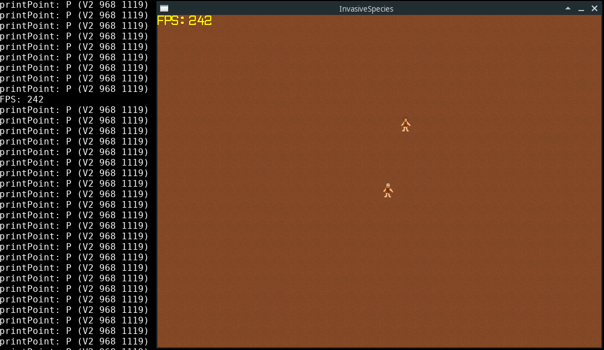

# InvasiveSpecies

A 2d game written in Haskell with Reflex FRP and SDL2 



## Features

* Tile based grid.
* Player avatar follows mouse press.
* Frames per seconds counter.
* Camera that follows the player in world coordinates
* Will be continued...

## How to use

### Prerequisites

This game uses SDL2, SDL_Image, and SDL_ttf, you need to have them installed in your system.

### To build

```bash
    stack build
```

### To run

```bash
    stack run
